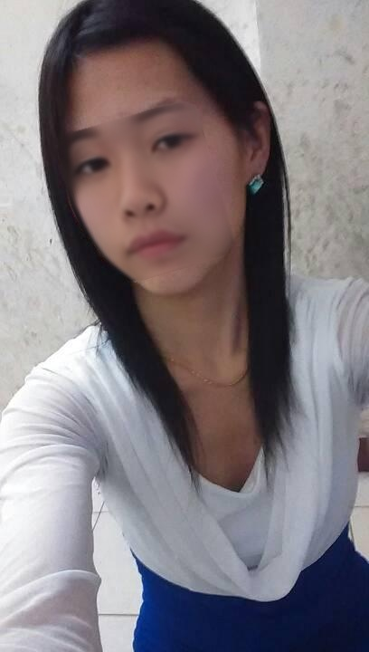
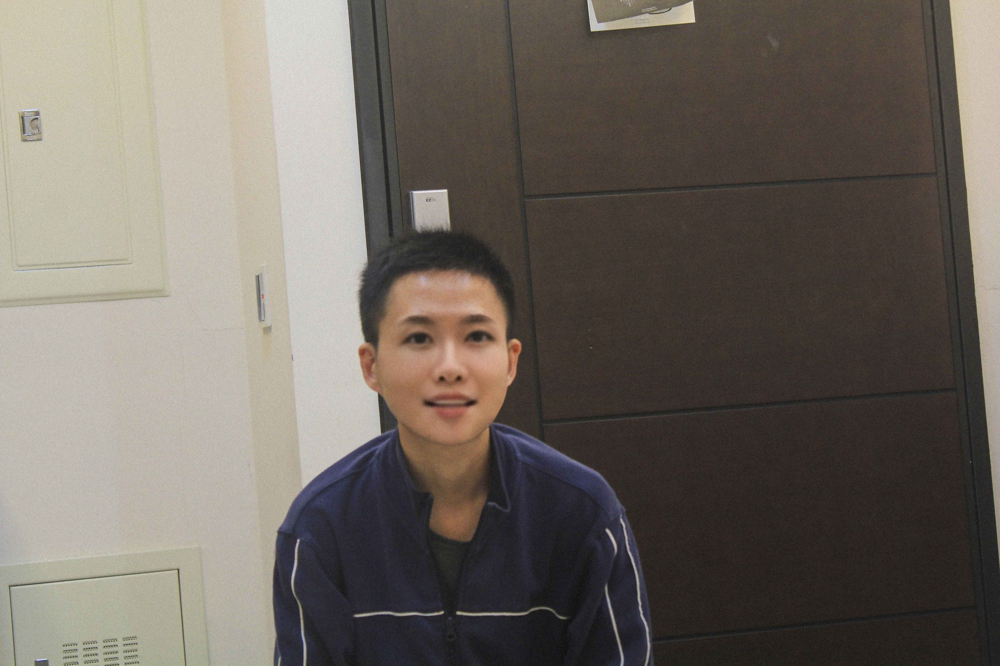

# Model Incubator

## Prerequisite

1. You need to install python3: `brew install python3.6 git`
2. git clone these three repository: 
	1. [Deepfakes-faceswap](https://github.com/ModelIncubator/Deepfakes-faceswap)
	2. [deepgaze](https://github.com/ModelIncubator/deepgaze)
	3. [FaceSwap](https://github.com/ModelIncubator/FaceSwap)

## Install

1. `docker build -t modelincubator .`
2. `nvidia-docker run -itd --name modelincubator -p 6006:6006 -p 8888:8888 modelincubator`

## Train (optional)

Read README of [Deepfakes-faceswap](https://github.com/ModelIncubator/Deepfakes-faceswap)

## Run

1. Download Training Data: [link](https://drive.google.com/open?id=1aTbHp0wqmNEfAUO5dN8aYrYfXTBP3AvM)
2. Preprocessing:
	```bash
	./preprocess.sh -i=<e.q. 美女寫真訓練資料.tar.gz>
	```
3. Training:
	```
	not complete
	```
4. FaceSwap:
	1. Integrated CMD:
		1. Only use original FaceSwap:
			
			```bash
			./run.sh -i=fixtures/normal_girl -m=/notebooks/Deepfakes-faceswap/model -tra=false
			```
		2. Use Traditional FaceSwap:

			```bash
			./run.sh -i=fixtures/normal_girl -m=/notebooks/Deepfakes-faceswap/model -tra=true -hp=金惠美 -ex=false
			```

			```bash
			./run.sh -i=fixtures/normal_girl -m=/srv/model -tra=true -hp=嚴智恩 -ex=false
			```
	2. Isolated CMD:
		1. Extract the face alignment of normal female that you want to convert using [Deepfakes-faceswap](https://github.com/ModelIncubator/Deepfakes-faceswap): `python3 faceswap.py extract -i <input> -o <output> -m <model>`
		2. Convert normal female to extrodinary female using [Deepfakes-faceswap](https://github.com/ModelIncubator/Deepfakes-faceswap): `python3 faceswap.py convert -i <input> -o <output> -m <model>`
		3. Select the picture with the most similar angle among beautiful girls using [Deepgaze](https://github.com/ModelIncubator/deepgaze): `python3 `
		4. Use [Traditional FaceSwap](https://github.com/ModelIncubator/FaceSwap) to get higher resolution: `python main.py --src <from> --dst <to> --out <output> --correct_color`

## Demo

| Source | Deepfakes | opencv |
| --- | --- | --- |
| |  |  |



